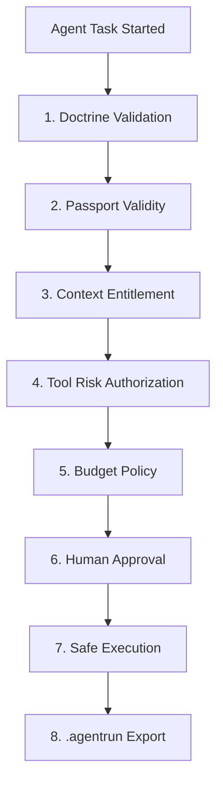

# 📦 TIMMY V1.5.0 Release Notes — Local Governed Context Registry
**Tag**: `v1.5.0-local-governed-context`  
**License Notice**: *Invented by William Meldman • Creator Attribution Shield Active*

---

## 🎯 The Commercial Wedge & Defensible Trust Layer
> [!IMPORTANT]
> **Is TIMMY an agent runner, or is TIMMY the trust layer around every agent runner?**
> TIMMY is explicitly **the trust layer**. That is a much more defensible and commercially valuable category position.
> 
> The single most powerful commercial wedge for TIMMY is:
> **Verified Context Packs + AgentPass Entitlements + Risk-Gated Tool Execution + Budget-Aware Model Routing + Tamper-Evident .agentrun Receipts**
> Enterprise users do not pay for raw static markdown documentation. They pay for **proven freshness, rigorous citation audits, gated subscription entitlements, and tamper-evident local audit receipts**.

### 📦 Ingestion Gating & Openverse Warning
The Openverse API is integrated as a free reference context pack for openly licensed media search. TIMMY does not treat returned assets as automatically cleared for commercial use; operators must verify each asset’s license and attribution before use. Openverse itself says it provides access to openly licensed and public-domain works, but also cautions that it cannot guarantee license accuracy and users should independently verify license information.

---

## 📐 The 8-Step Deterministic Gating Sequence
TIMMY V1.5.0 establishes deterministic, local-first runtime governance inside the governed TIMMY runner by funneling coding agents through a fixed sequence of execution gates before any system command executes:



1. **Doctrine Validation**: Audit local files against `DOCTRINE.md` (ensuring alignment with headers, rules, and attributions).
2. **Passport Validity**: Verify the AgentPass visa token has not expired and matches secure hash-bound claims.
3. **Context Entitlement**: Evaluate requested documentation context read scopes against passport entitlement permissions.
4. **Tool Risk Authorization**: Classify tools under strict risk classes and risk levels, preventing execution of unauthorized high-risk operations.
5. **Budget Policy**: Enforce spent caps and execute fallback routing (e.g. shifting to efficient models) in `NORMAL`, `CAUTION`, `EMERGENCY`, or `BLOCKED` status zones.
6. **Human Approval**: Block high-risk workspace mutations pending explicit operator double-confirmation prompts.
7. **Safe Execution**: Perform file mutations safely with automatic, secure, timestamped backups locked to `chmod 600`.
8. **.agentrun Receipt Export**: Compile a redacted, tamper-evident hash-bound `.agentrun` folder receipt containing the rich `terminal_intelligence` analytics block.

---

## 💻 Unified Operator CLI Commands

TIMMY V1.5.0 delivers 100% functional parity between TUI panel displays and semantic console CLI commands:

### A. Environment Diagnostics
```bash
PYTHONPATH=src .venv/bin/python -m founder_terminal.cli doctor
```

### B. Strategic Blueprinting
```bash
PYTHONPATH=src .venv/bin/python -m founder_terminal.cli strategy show
PYTHONPATH=src .venv/bin/python -m founder_terminal.cli strategy gaps
```

### C. Ref.ai Context Registry Management
```bash
# List all registered context packs and freshness gate states
PYTHONPATH=src .venv/bin/python -m founder_terminal.cli context list

# Audit pack freshness, citation map, and licenses
PYTHONPATH=src .venv/bin/python -m founder_terminal.cli context validate openverse-openapi

# Preview formatted LLM system context prompt payload injection
PYTHONPATH=src .venv/bin/python -m founder_terminal.cli context inject-preview openverse-openapi
```

### D. AgentPass Entitlement Auditing
```bash
# View active local mock passport credentials claims status
PYTHONPATH=src .venv/bin/python -m founder_terminal.cli agentpass status

# Mint a secure representation token (agentpass:first8...last8)
PYTHONPATH=src .venv/bin/python -m founder_terminal.cli agentpass mint-demo

# Verify specific tool calls and risk classes against the passport
PYTHONPATH=src .venv/bin/python -m founder_terminal.cli agentpass verify-demo --tool "workspace.write" --risk-class "workspace_mutation" --risk-level "medium" --cost 0.01
```

### E. TaskForge Workspace Previewing
```bash
# Render visual orchestration diagram flowchart
PYTHONPATH=src .venv/bin/python -m founder_terminal.cli taskforge preview-governed-demo

# Display the registered 5-Agent Council configuration table
PYTHONPATH=src .venv/bin/python -m founder_terminal.cli taskforge preview-council
```

### F. Stateful Governed Demo Runner
```bash
# Execute the full 8-step governed sandbox loop under live operator input
PYTHONPATH=src .venv/bin/python -m founder_terminal.cli governed-demo
```

---

## 🏁 Proof Artifacts & Live Demo

### A. Live Sandbox Runner Command
To execute the live 8-step deterministic governed loop under operator double-confirmation:
```bash
PYTHONPATH=src .venv/bin/python -m founder_terminal.cli governed-demo
```

### B. Generated Verification Facts Artifact
* **Local Facts Path**: `artifacts/governed-demo/FACTS.md`
* Carrying: session ID, verified doctrine SHA-256 hash, validated context pack hashes, selected model route, risk classification, approval outcome, and receipts path.

### C. Receipt Replay Bundle
* **Local Receipt Folder**: `~/.founder-terminal/runs/<run_id>.agentrun`
* **Receipt Manifest**: `~/.founder-terminal/runs/<run_id>.agentrun/manifest.json`

---

## 🧾 Tamper-Evident .agentrun Receipt Schema

The `.agentrun/manifest.json` receipt provides enterprise-grade observability and auditability. It is **tamper-evident** and **hash-bound** (not cryptographically signed, as V1.5 relies on deterministic SHA-256 hashes of payloads and credentials):

```json
{
  "run_id": "run_governed_demo_YYYYMMDD_HHMMSS",
  "title": "AgentOps Docs Session",
  "created_at": "ISO-8601 Timestamp",
  "completed_at": "ISO-8601 Timestamp",
  "status": "COMPLETED",
  "runtime_mode": "local_sdk",
  "sandbox_mode": "process",
  "llm_profile": "openrouter_default",
  "requested_model": "anthropic/claude-sonnet-4",
  "budget_policy_zone": "CAUTION",
  "selected_model": "qwen/qwen-2.5-coder-32b",
  "selection_reason": "Cautionary Fallback: Routing shifted...",
  "execution_mode": "simulated",
  "operator": "William Meldman",
  "license": "invented by William Meldman • Creator Attribution Shield Active",
  
  "terminal_intelligence": {
    "command_count": 6,
    "tool_call_count": 12,
    "approval_count": 1,
    "denied_action_count": 0,
    "context_pack_count": 3,
    "active_agent_roles": ["planner", "coder", "reviewer"],
    "selected_model": "qwen/qwen-2.5-coder-32b",
    "fallback_reason": "budget_caution",
    "budget_zone": "CAUTION",
    "run_duration_ms": 1420,
    "receipt_version": "1.5"
  },
  
  "doctrine_hash": "SHA-256 hash of DOCTRINE.md",
  "env_backup_path": "Path to generated facts backup file",
  "redacted_key_fingerprint": "None",
  "payload_preview_hash": "SHA-256 hash of inject-preview payload",
  "validation_status": "PASS",
  "passport_jti_hash": "SHA-256 hash of Passport JTI ID",
  "passport_issuer": "agentpass:iss:timmy",
  "passport_subject": "agent:timmy-governed-demo",
  "passport_verification_status": "APPROVAL_REQUIRED",
  
  "context_pack_id": "openrouter-agent-sdk",
  "context_pack_version": "1.1.0",
  "context_source_hash": "e3b0c44298fc1c149afbf4c8996fb9242...",
  "context_access_scope": "context.read.openrouter_agent_sdk",
  "retrieval_query_hash": "dd06ef51e18336b6b57704faf...",
  "context_validation_status": "PASS"
}
```

---

## 🚫 Known V1.5.0 Non-Goals (Scope Gating)

To maintain absolute local stability and focus, the following features are **explicitly postponed** to future release milestones:
1. **Public Marketplace UI**: Postponed (Local registry proof has absolute priority).
2. **Stripe Billing Integration**: Strategy-only (Not built in V1.5 runtime).
3. **Cloudflare Sync**: Postponed (Local receipt proof must stabilize first).
4. **Real 5-Agent Concurrency**: Postponed (TaskForge registers roles and parameters; execution remains single-threaded).
5. **DGX/NAS Refinery Automation**: Postponed (Supply chain concepts are documented as strategic architecture; automated pipelines will ship in V1.6+).

---

## 🚀 The Aspirational Next Step: "Receipt-to-Context Feedback"
The ultimate product evolution for TIMMY is **Receipt-to-Context Feedback**:
Every completed `.agentrun` receipt can be continuously ingested back into the **Context Registry** as fine-tuning feedback or evaluation datasets. This creates a self-improving governed context refinery loop without requiring direct model training!
