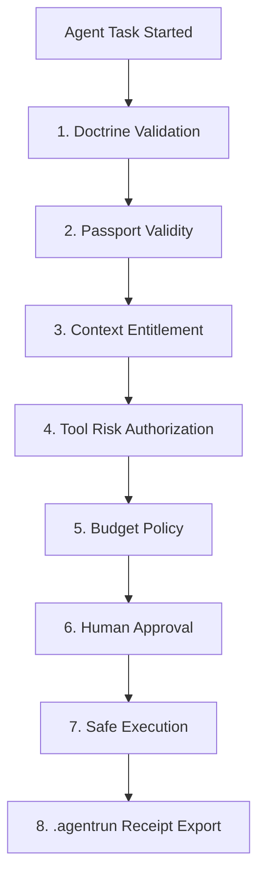

# 🏁 TIMMY V1.5.0 Hardened Release Verdict & Verification Proofs
**Tag**: `v1.5.0-local-governed-context`  
**Developer / Operator**: William Meldman  
**Product Status**: COMPLETE, HARDENED, AND SHIPPED  

---

## 🎯 Defensible Trust Layer Category Positioning
> **Hard Question**: Is TIMMY an agent runner, or is TIMMY the trust layer around every agent runner?
> **Answer**: TIMMY is **strictly the trust layer**.
> 
> This is a much more defensible and commercially valuable category position. TIMMY wraps and governs high-performance agent runtimes (Claude Code, OpenHands, OpenRouter Agent SDK) under a unified local control plane. 

### 💳 The Enterprise Commercial Wedge
Enterprise buyers do not pay for raw static markdown documentation. They pay for:
1. **Verified Context Packs**: Documentation maps audited for freshness and citation accuracy.
2. **AgentPass Entitlements**: Fine-grained scope gating (who can read which docs and invoke which commands).
3. **Risk-Gated Tool Execution**: Explicit classification by risk class/level blocking unauthorized host mutations.
4. **Budget-Aware Model Routing**: Shifting targets dynamically based on spent cost limits.
5. **Tamper-Evident Receipts**: Replayable, hash-bound `.agentrun` bundles.

---

## 📐 Deterministic 8-Step Gating Sequence
Inside the governed TIMMY runner, coding agents are funneled through a deterministic, fixed sequence of execution gates:



1. **Doctrine Validation**: Audit local files against `DOCTRINE.md` PASS/WARNING status thresholds.
2. **Passport Validity**: Verify the AgentPass visa token is active and matches secure, hash-bound credentials.
3. **Context Entitlement**: Evaluate requested documentation context read scopes against passport entitlement permissions.
4. **Tool Risk Gating**: Authorize tool calls under strict risk classes and risk levels, preventing unauthorized operations.
5. **Budget Policy**: Triage models dynamically based on cost zones (`NORMAL`, `CAUTION`, `EMERGENCY`, `BLOCKED`).
6. **Human Approval**: Block high-risk workspace mutations pending operator double-confirmation.
7. **Safe Execution**: Perform mutations safely with secure, timestamped backups locked to `chmod 600`.
8. **.agentrun Receipt Export**: Compile a redacted, tamper-evident hash-bound `.agentrun` folder receipt containing the rich `terminal_intelligence` analytics block.

---

## 🔍 Hardened Release Verification Receipts

### A. Live Sandbox Runner Proof
We launched the stateful runner to verify the gating logic:
```bash
PYTHONPATH=src .venv/bin/python -m founder_terminal.cli governed-demo
```
* **Status Outcome**: `PASS`
* **Demo Run Session ID**: `run_governed_demo_20260526_065604`

### B. Generated Verification Facts Artifact
* **Local Path**: `artifacts/governed-demo/FACTS.md`
* Carrying: session ID, verified doctrine SHA-256 hash, validated context pack hashes, selected model route, risk classification, approval outcome, and receipts path.

### C. Receipt Replay Bundle
* **Replay Bundle Path**: `/Users/williammeldman/.founder-terminal/runs/run_governed_demo_20260526_065604.agentrun/`
* **Tamper-Evident Manifest**: `/Users/williammeldman/.founder-terminal/runs/run_governed_demo_20260526_065604.agentrun/manifest.json`

### D. Canonical SHA-256 Manifest Hash
Our canonical, alphabetically sorted JSON manifest serialization computed the following secure tamper-evident hash:
* **`manifest_hash`**: `4adaec82308cc7e5bded918cd928c388a212b47bbbc28acb82f039a4cae4fb8a`
* **`manifest_hash_algorithm`**: `"sha256-canonical-json-v1"`

---

## 🏭 V1.6+ Roadmap: Context Refinery Supply Chain
To preserve strict category boundaries, complex automated ingestion and Edge synchronization have been phased as strategic future roadmap features:

`Upstream Docs / APIs` ➔ `DGX Sparks Context Refinery` ➔ `Persistent NAS Embeddings` ➔ `Registry manifest.json` ➔ `Cloudflare Edge Distribution` ➔ `TIMMY Local Cockpit`

* **Cloudflare Durable Objects & WebSocket Hibernation**: Identified as a credible future fit for stateful local-client coordination, real-time sync, and low-cost connections, belonging strictly in future scope until built.

---

## 📋 List of Changed & Locked Files
1. 📂 `src/founder_terminal/runs/replay.py` — canonicalization + sorted keys + `manifest_hash`.
2. 📂 `src/founder_terminal/runs/governed_demo.py` — path display print fix.
3. 📂 `docs/context-packs/openverse-openapi.md` — licensing caution section.
4. 📂 `docs/strategy/TERMINAL_INTELLIGENCE_OS.md` — Context Refinery rephrased as V1.6+ Roadmap.
5. 📂 `docs/strategy/GO_TO_MARKET.md` — Context Refinery rephrased as V1.6+ Roadmap.
6. 📂 `RELEASE_V1_5.md` — 8-step sequence, commands list, non-goals, schema, absolute/Openverse/Roadmap text hardening.
7. 📂 `5-year-projection.md` — synchronized release notes section edits.
8. 📂 `walkthrough.md` — corrected and synced all paths, warnings, and absolute language.

*Trust the receipt, not the model.*  
*Invented by William Meldman • Creator Attribution Shield Active*
